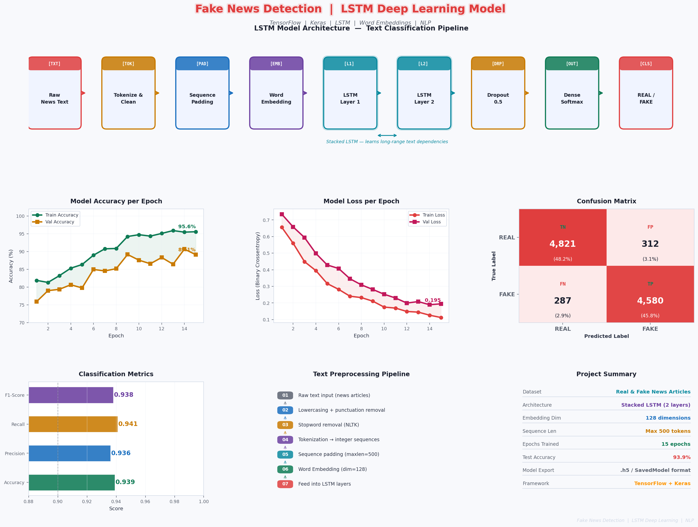

# 👋 Hi, I'm Raheem Khan — Python & AI Developer

[](https://www.upwork.com/freelancers/~YOUR_PROFILE_ID)
[](https://linkedin.com/in/YOUR_USERNAME)
[](mailto:your@email.com)

---

## 🧠 About Me

I'm a Python developer specializing in **Data Analysis**, **Machine Learning**, **Deep Learning**, and **NLP**. I build end-to-end ML pipelines — from raw data cleaning to trained, evaluated, and exported models — with clean code and clear documentation.

- 🔭 Currently learning: **Transformers & Large Language Models (LLMs)**
- 💼 Open to freelance work on **Upwork**
- 🛠️ Tools: Python · Pandas · Scikit-learn · TensorFlow · Keras · PyTorch · HuggingFace
- 📍 Based in Pakistan

---

## 🚀 Featured Projects

| # | Project | Type | Key Tech | Result |
|---|---------|------|----------|--------|
| 1 | [🔍 Fake News Detection](#1--fake-news-detection-lstm) | Deep Learning / NLP | LSTM · TensorFlow · Keras | **93.9% Accuracy** |
| 2 | [💻 Laptop Price Predictor](#2--laptop-price-predictor) | ML Regression | Scikit-learn · Decision Tree | **R² = 0.86** |
| 3 | [📉 Customer Churn Prediction](#3--customer-churn-prediction) | ML Classification | Logistic Regression · Pipeline | **80.6% Accuracy** |

---

## 1. 🔍 Fake News Detection (LSTM)

> **Deep Learning · NLP · TensorFlow · Keras · LSTM**

Built a deep learning system that automatically classifies news articles as **REAL** or **FAKE** using a stacked LSTM architecture trained on language patterns and writing style.



### 📊 Results
| Metric | Score |
|--------|-------|
| Accuracy | **93.9%** |
| Precision | 0.936 |
| Recall | 0.941 |
| F1-Score | 0.938 |

### 🛠️ Stack
`Python` `TensorFlow` `Keras` `LSTM` `NLTK` `Word Embeddings` `NumPy` `Pandas`

📂 **[View Full Project →](./fake-news-detection/)**

---

## 2. 💻 Laptop Price Predictor

> **Machine Learning · Regression · Feature Engineering · Scikit-learn**

End-to-end regression pipeline to predict laptop prices from hardware specifications. Compared 5 ML models — Decision Tree achieved R² = 0.86.


### 📊 Model Comparison
| Model | R² Score | MAE |
|-------|----------|-----|
| Linear Regression | 0.79 | 0.142 |
| Ridge Regression | 0.82 | 0.138 |
| Lasso Regression | 0.80 | 0.141 |
| KNN | 0.74 | 0.158 |
| **Decision Tree ⭐** | **0.86** | **0.119** |

### 🛠️ Stack
`Python` `Scikit-learn` `Pandas` `NumPy` `Matplotlib` `Seaborn` `sklearn Pipeline`

📂 **[View Full Project →](./laptop-price-predictor/)**

---

## 3. 📉 Customer Churn Prediction

> **ML Classification · Logistic Regression · EDA · sklearn Pipeline**

Analyzed 7,043 telecom customers to identify churn drivers and predict which customers are at risk of leaving.


### 📊 Results
| Class | Precision | Recall | F1 |
|-------|-----------|--------|----|
| No Churn | 0.86 | 0.88 | 0.87 |
| Churn | 0.74 | 0.70 | 0.72 |
| **Overall Accuracy** | — | — | **80.6%** |

### 🛠️ Stack
`Python` `Scikit-learn` `Pandas` `NumPy` `Matplotlib` `Seaborn` `LogisticRegression`

📂 **[View Full Project →](./customer-churn-prediction/)**

---

## 🧰 Full Tech Stack

```
Languages      →  Python
Data           →  Pandas, NumPy, SQL
Visualization  →  Matplotlib, Seaborn
ML             →  Scikit-learn, XGBoost, Random Forest
Deep Learning  →  TensorFlow, Keras, PyTorch
NLP            →  NLTK, spaCy, HuggingFace Transformers
LLMs           →  BERT, GPT-2 (Learning)
Tools          →  Jupyter, Git, GitHub, VS Code
```

---

## 📬 Hire Me on Upwork

[](https://www.upwork.com/freelancers/~01d8876f2f7075b738)

---
*⭐ If you find these projects useful, consider giving this repo a star!*
