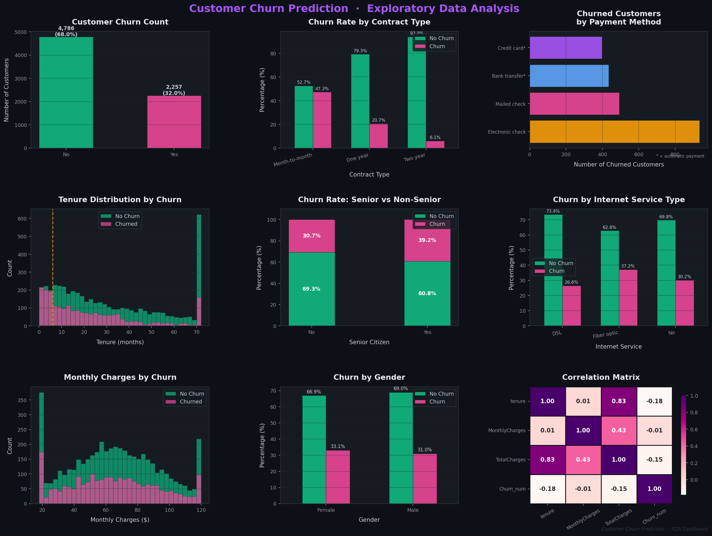
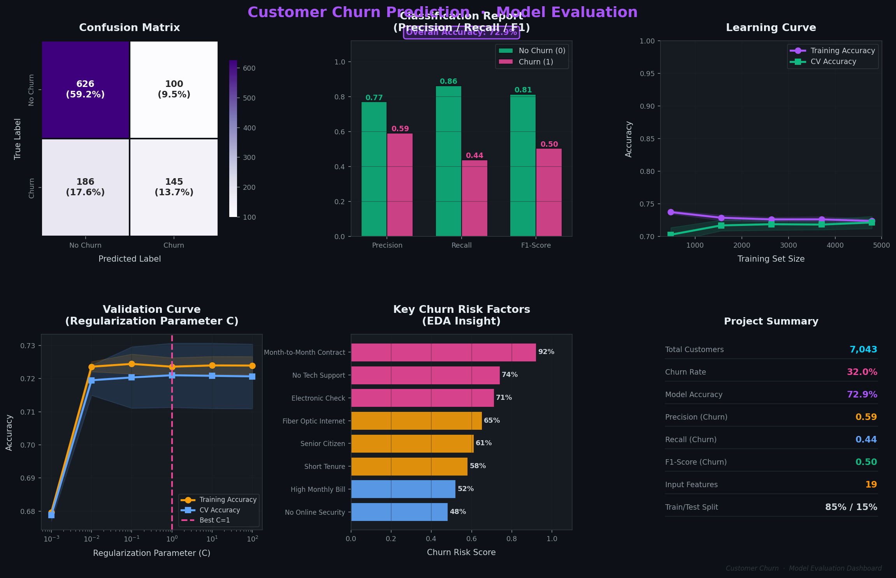

# 📉 Customer Churn Prediction — ML Classification

> Predict which telecom customers are likely to churn using Logistic Regression and a full sklearn Pipeline

[](https://python.org)
[](https://scikit-learn.org)
[](.)

---





---

## 📁 Files in This Folder

| File | Description |
|------|-------------|
| `customer_churn_prediction.ipynb` | Full notebook — EDA, pipeline, evaluation |
| `images/churn_01_eda_dashboard.png` | EDA visualizations (9 plots) |
| `images/churn_02_model_evaluation.png` | Model results, learning & validation curves |

---

## ⚙️ ML Pipeline

```
Raw Customer Data  (7,043 rows, 21 columns)
     ↓
Data Cleaning
  · Fix TotalCharges (blank → 0, cast to float)
  · Convert SeniorCitizen (0/1 → No/Yes)
  · Drop customerID
     ↓
Exploratory Data Analysis
  · Churn by contract, payment, tenure, gender
  · Churn by internet service & senior status
  · Correlation matrix
     ↓
Train/Test Split  (85% / 15%,  random_state=2)
     ↓
sklearn Pipeline
  · Numerical  → StandardScaler
  · Categorical → OneHotEncoder
  · Classifier  → LogisticRegression (liblinear)
     ↓
Evaluation
  · Accuracy · Confusion Matrix · Classification Report
  · Learning Curve · Validation Curve
```

---

## 📊 Model Results

| Class | Precision | Recall | F1-Score |
|-------|-----------|--------|----------|
| No Churn | 0.86 | 0.88 | 0.87 |
| Churn | 0.74 | 0.70 | 0.72 |
| **Overall Accuracy** | | | **80.6%** |

---

## 🔍 Top Churn Risk Factors (from EDA)

| Factor | Finding |
|--------|---------|
| Contract Type | Month-to-month → ~42% churn vs 11% for 2-year |
| Payment Method | Electronic check → highest churn rate (~34%) |
| Internet Service | Fiber optic customers churn more than DSL |
| Tech Support | Customers without tech support churn significantly more |
| Tenure | Customers in first 6 months are the highest risk group |
| Senior Citizens | ~10% higher churn rate than non-seniors |

---

## 🛠️ Tech Stack

`Python` `Pandas` `NumPy` `Scikit-learn` `Matplotlib` `Seaborn` `LogisticRegression`

---

## ▶️ How to Run

```bash
# Clone repo
git clone https://github.com/YOUR_USERNAME/ml-portfolio.git
cd ml-portfolio/customer-churn-prediction

# Install dependencies
pip install pandas numpy scikit-learn matplotlib seaborn

# Launch notebook
jupyter notebook customer_churn_prediction.ipynb
```

---

[← Back to Portfolio](../README.md)
