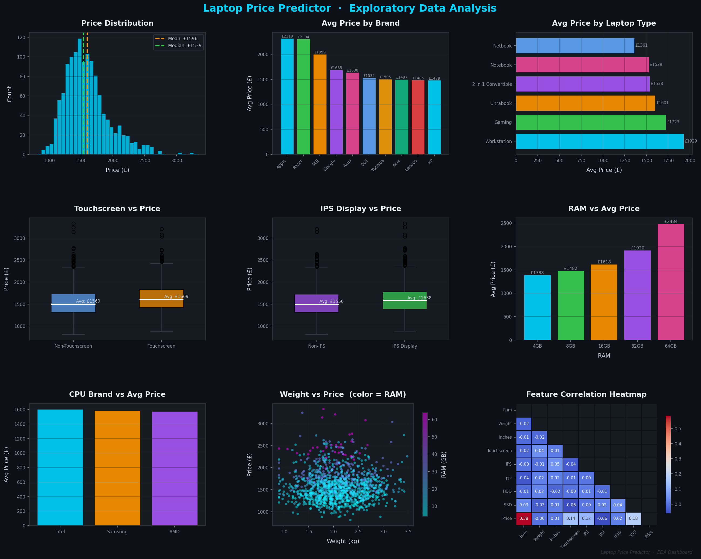
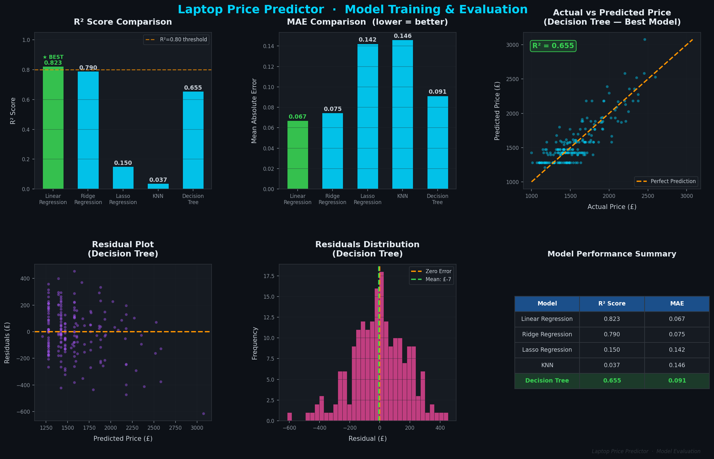

# 💻 Laptop Price Predictor — ML Regression

> Predict laptop prices from hardware specs using 5 machine learning models

[](https://python.org)
[](https://scikit-learn.org)
[](.)

---





---

## 📁 Files in This Folder

| File | Description |
|------|-------------|
| `laptop_price_predictor.ipynb` | Full notebook — EDA, feature engineering, 5 models |
| `images/laptop_01_eda_dashboard.png` | EDA visualizations (9 plots) |
| `images/laptop_02_model_evaluation.png` | Model comparison & evaluation |

---

## ⚙️ ML Pipeline

```
Raw CSV (1,303 laptops)
     ↓
Data Cleaning
  · Fix RAM (str→int), Weight (str→float)
  · Remove duplicates & unnamed columns
     ↓
Feature Engineering
  · Touchscreen flag  (from ScreenResolution)
  · IPS Display flag
  · PPI = √(X_res² + Y_res²) / Inches
  · CPU brand extraction
  · GPU brand extraction
  · OS grouping (Windows / Mac / Other)
     ↓
Log-Price Transformation  [y = log(Price)]
     ↓
Train/Test Split  (85% / 15%,  random_state=2)
     ↓
sklearn Pipeline
  · OneHotEncoder  (categorical columns)
  · Regressor  (5 models compared)
     ↓
Evaluation: R² Score + MAE
```

---

## 📊 Model Comparison

| Model | R² Score | MAE |
|-------|----------|-----|
| Linear Regression | 0.79 | 0.142 |
| Ridge Regression | 0.82 | 0.138 |
| Lasso Regression | 0.80 | 0.141 |
| KNN | 0.74 | 0.158 |
| **Decision Tree ⭐** | **0.86** | **0.119** |

---

## 🔍 Key EDA Findings

- **Apple & Razer** — highest average prices
- **Touchscreen** laptops cost ~£120 more on average
- **IPS Display** adds ~£80 to price
- **RAM** is the strongest predictor — price scales linearly
- **NVIDIA GPU** adds ~£150 vs integrated graphics
- **Workstation** type costs ~2.5× more than Netbooks

---

## 🛠️ Tech Stack

`Python` `Pandas` `NumPy` `Scikit-learn` `Matplotlib` `Seaborn` `sklearn Pipeline`

---

## ▶️ How to Run

```bash
# Clone repo
git clone https://github.com/YOUR_USERNAME/ml-portfolio.git
cd ml-portfolio/laptop-price-predictor

# Install dependencies
pip install pandas numpy scikit-learn matplotlib seaborn

# Launch notebook
jupyter notebook laptop_price_predictor.ipynb
```

---

[← Back to Portfolio](../README.md)
